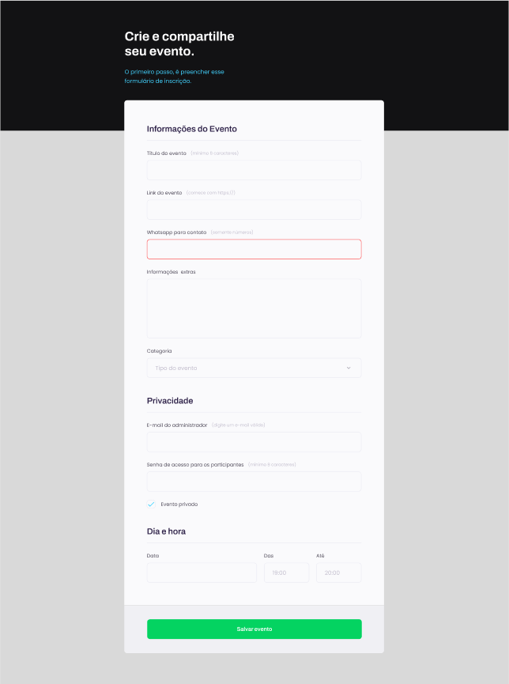

<h1 align="center">🚀 Projeto de um formulário: "Crie seu Evento" </h1>

Este é um projeto da RocketSeat do programa Explore composto por 20 módulos, com dezenas de aulas e tem como objetivo desenvolver habilidades técnicas e comportamentais a fim de que o aluno consiga se posicionar como profissional, conquiste oportunidades no mercado de trabalho e lide com desafios reais.são projetos do curso, promovido pela Rocketseat para ensino de tecnologias WEB.  

  <a href="#-tecnologias">Tecnologias</a>&nbsp;&nbsp;&nbsp;|&nbsp;&nbsp;&nbsp;
  <a href="#-link">Link</a>&nbsp;&nbsp;&nbsp;|&nbsp;&nbsp;&nbsp;
  <a href="#memo-licença">Licença</a>

  

 

  

 

[Visualise o Projeto aqui](https://explorer-desafio-05-formulario-crie-seu-evento.vercel.app/)

## 💻 Sobre o Projeto

Esse projeto foi desenvolvido durante uma aula com o objetivo de aprender sobre todos os campos de entrada de um formulário.
Durante o processo, enfrentamos diversos desafios, um deles foi substituir a caixa de seleção do checkbox por uma personalizada utilizando CSS.
Além disso, exploramos as diferentes funcionalidades do botão quando utilizado tanto dentro quanto fora do formulário, assim como a utilização do input fora do escopo do campo FORM.

## 🚀 Tecnologias

Esse projeto foi desenvolvido com as seguintes tecnologias:

- HTML e CSS
- Git e Github
- Figma

## 🪐 Link

Você pode visualizar o projeto através [DESSE LINK](https://explorer-desafio-05-formulario-crie-seu-evento.vercel.app/). 

## :memo: Licença

Esse projeto está sob a licença MIT.

---

Criado pela [RocketSeat](https://app.rocketseat.com.br/me/tone-monte-05654) 💜 Feito com 💛 por [Tone Lopes](https://tonelopes.github.io/portfolio/#home)
